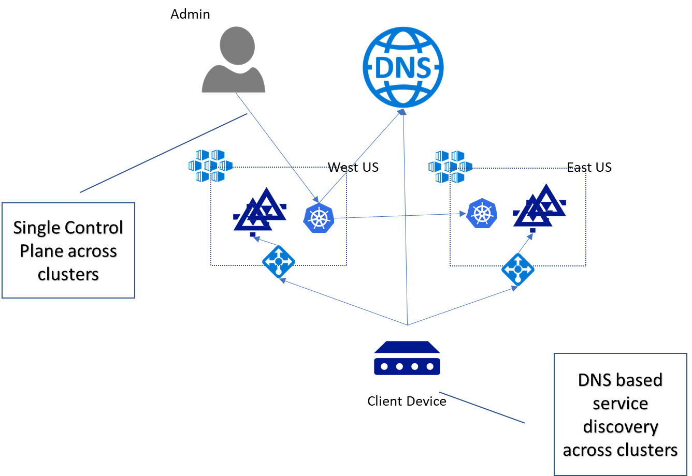
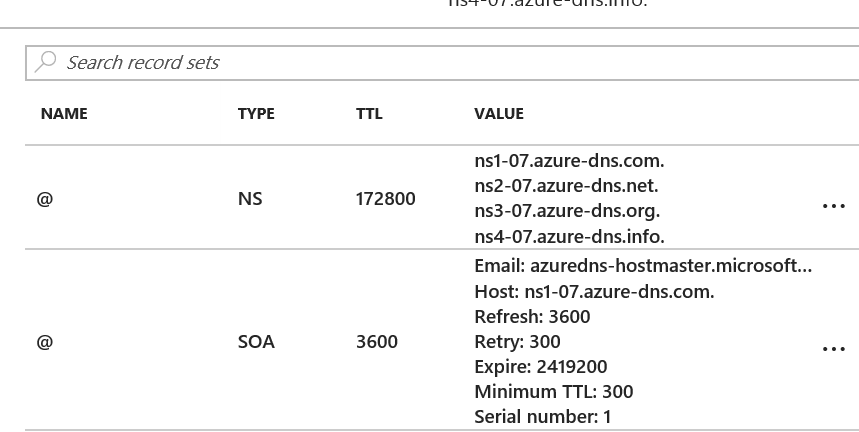
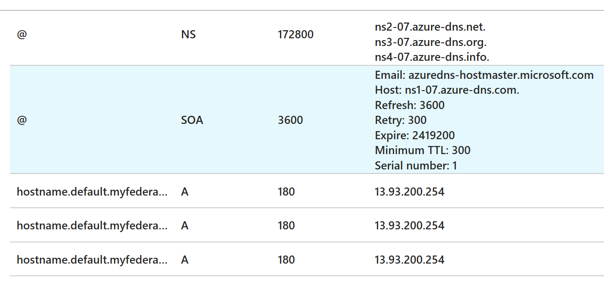
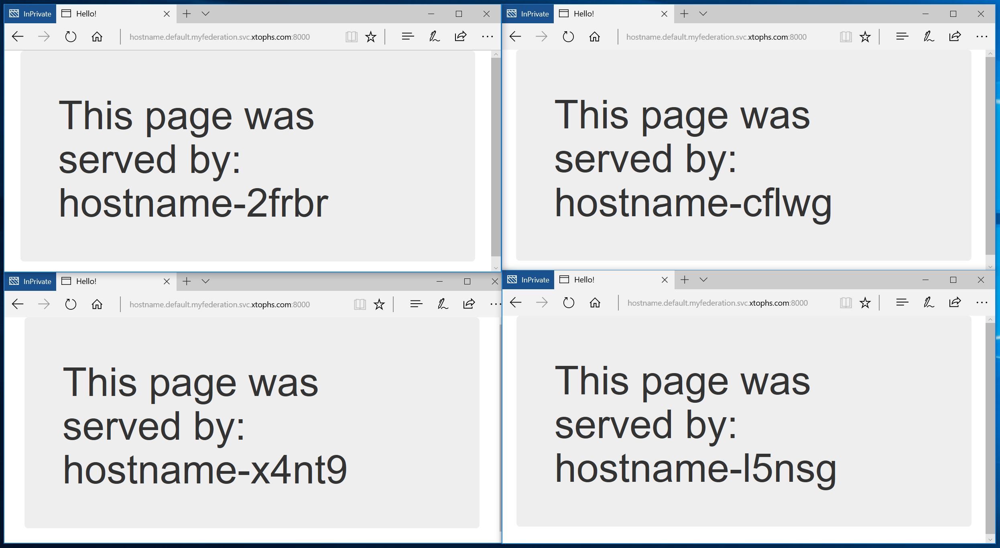
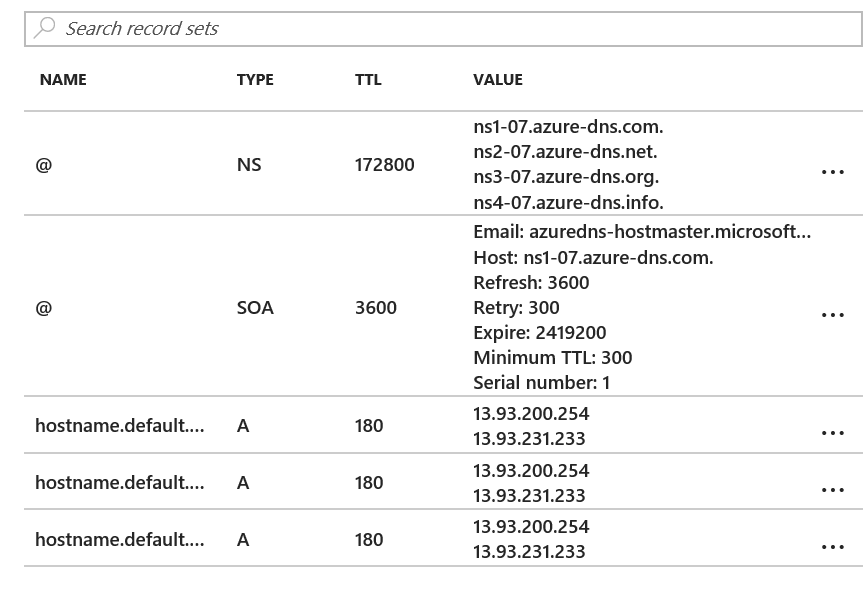

#Kubernetes Federation on Azure

Kubernetes Federation provides, among others, 2 benefits as depicted in the diagram below. 
1.	An administrator can manage multiple, possibly geo-distributed, clusters through a single control plane.
2.	Service consumers can discover services running in these distributed clusters using standard DNS name resolution



The Azure DNS federation provider for kubernetes allows for federating kubernetes clusters running in Azure. 
The setup process is straight-forward

## Set up 
### DNS zone for the federated service
1. Create an Azure Resource Group, for example
```
az group create -l westus -n fed-dns-rg
```

2. Add a DNS Zone for your federation from the portal or via
```
$ az network dns zone create -n xtophs.com -g fed-dns-rg
{
  "etag": "00000002-0000-0000-bad4-5dd8d5dfd201",
  "id": "/subscriptions/MYSUB/resourceGroups/fed-dns-rg/providers/Microsoft.Network/dnszones/xtophs.com",
  "location": "global",
  "maxNumberOfRecordSets": 5000,
  "name": "xtophs.com",
  "nameServers": [
    "ns1-01.azure-dns.com.",
    "ns2-01.azure-dns.net.",
    "ns3-01.azure-dns.org.",
    "ns4-01.azure-dns.info."
  ],
  "numberOfRecordSets": 2,
  "resourceGroup": "fed-dns-rg",
  "tags": {},
  "type": "Microsoft.Network/dnszones"
}
```

You should see a zone with an NS and an SOA record



or from the command line
```
$ az network dns record-set list --zone-name xtophs.com -g fed-dns-rg -o table
Name    ResourceGroup        Ttl
------  ----------------  ------
@       xtoph-delete-dns  172800
@       xtoph-delete-dns    3600
```


### Create a Service Principal with access to the DNS service
Create an AAD Service Principal with Contributor access scoped to the resource group in which the DNS Zone is located (You could probably scope just to the DNS zone)

```
az ad sp create-for-rbac -n "http://MyApp" --role contributor --scopes /subscriptions/[your subscription id]/resourceGroups/[your resource group]
```

Make note of `appId`, `password` and `tenant`. Those will need to go into the provider config file. 

You can get the subscription ID with:

### Prepare the DNS provider config file
Edit the `dns.conf` file in this folder with the configuration for your resource group and your service principal
```
[Global]
subscription-id = 
tenant-id = [sp tenant]
client-id = [sp appId]
secret = [sp password]
resourceGroup = fed-dns-rg
``` 

### Deploy a Federation Host Cluster (can be automated by running [setup-fedhost.sh](setup-fedhost.sh) on the master)
Setup a kubernetes 1.6+ cluster. Until kubernetes 1.6 is supported by ACS, you can create an ARM templates using [acs-engine](https://github.com/Azure/acs-engine). 

### Connect to the Federation Host Cluster
1. Get the IP address of the master load balancer
```
ipName=$(az resource list -g ${2} --resource-type Microsoft.Network/publicIPAddresses --query [0].name --out tsv) 

ipAddress=$(az resource show -g ${2} --resource-type Microsoft.Network/publicIPAddresses -n $ipName --query properties.ipAddress --out tsv)
echo Address is $ipAddress
```

2. Connect
```
ssh azureuser@${ipAddress}
```

### Prepare to use kubefed (currently needed to avoid errors):
1. Create a Permissive Cluster Role binding
```
$ kubectl create clusterrolebinding permissive-binding   --clusterrole=cluster-admin   --user=client   --group=system:serviceaccounts
clusterrolebinding "permissive-binding" created
```

Note: without the permissive binding, you'll encounter an error like:

```
F0607 16:41:25.631652    9130 helpers.go:120] Error from server (Forbidden): roles.rbac.authorization.k8s.io "federation-system:federation-controller-manager" is forbidden: attempt to grant extra privileges: [{[get] [] [secrets] [] []} {[list] [] [secrets] [] []} {[watch] [] [secrets] [] []}] user=&{client  [system:authenticated] map[]} ownerrules=[] ruleResolutionErrors=[]
```

2. Configure the `apiserver` for RBAC. Edit `/etc/kubernetes/manifests/kube-apiserver.yaml` to start the apiserver with `"--authorization-mode=RBAC`:

```
[...]
spec:
  hostNetwork: true
  containers:
    - name: "kube-apiserver"
      image: "gcrio.azureedge.net/google_containers/hyperkube-amd64:v1.6.2"
      command:
        - "/hyperkube"
        - "apiserver"
        - "--authorization-mode=RBAC"
[...]
```

3. Reboot
```
sudo reboot
```

4. Get/Update kubefed
```
curl -LO https://dl.k8s.io/v1.7.0-alpha.4/kubernetes-client-linux-amd64.tar.gz
tar xzf kubernetes-client-linux-amd64.tar.gz


sudo cp kubernetes/client/bin/kubefed /usr/local/bin
sudo chmod +x /usr/local/bin/kubefed
sudo cp kubernetes/client/bin/kubectl /usr/local/bin
sudo chmod +x /usr/local/bin/kubectl
```

### Set up federation
1. Copy the dnsprovider config file to the master
```
scp ./dns.conf azureuser@${ipAddress}:~/dns.conf
```

2. Reconnect to the master node
```
ssh azureuser@${ipAddress}
```

3. Initialize federation
For K8s 1.6.x
```
kubefed init myfederation --host-cluster-context=[your cluster name]  --dns-provider="azure-azuredns" --dns-zone-name="xtophs.com" --dns-provider-config=~/dns.conf --image=xtoph/hyperkube-amd64:azuredns.20
```

For K8s 1.7.x
```
kubefed init myfederation --host-cluster-context=[your cluster name]  --dns-provider="azure-azuredns" --dns-zone-name="xtophs.com" --dns-provider-config=~/dns.conf --image=xtoph/hyperkube-amd64:xtoph.azuredns.2
```

3. [Ensure there is a default namespace](https://kubernetes.io/docs/tasks/federation/set-up-cluster-federation-kubefed/#deploying-a-federation-control-plane)
If `kubectl get namespace --context=myfederation` doesn't show anything, create the namespace:
```
kubectl create namespace default --context=myfederation
```

In some cases, it takes a while for the federation-apiserver to come up. You may see the federation-controller-manager restart and errors like: ```Could not find resources from API Server: Get https://federation-apiserver:443/api: dial tcp 10.0.206.126:443: i/o timeout``` in the federation-controller-manager logs.It may take several restarts of the pod until the federation apiserer is reachable.

4. Switch to the federation cluster
```
kubectl config use-context myfederation
```

5. . Join your cluster
```
kubefed join [your cluster name] --host-cluster-context=[your cluster name] --cluster-context=[your cluster name]
```

Confirm you have a federation with one cluster

```
kubectl get clusters
NAME         STATUS    AGE
fed-west     Ready     13s
``` 

### Deploy a ReplicaSet into the federation cluster
@OguzPastirmaci has a [great little service](https://github.com/OguzPastirmaci/hostname) to demonstrate federation is working.

1. Get the Code
```
git clone https://github.com/OguzPastirmaci/hostname```
```
- `kubectl create -f rs/nginx.yaml`
- Change the service file `services/nginx.yaml` to type `LoadBalancer`
- `kubectl create -f services/nginx.yaml`

2. Deploy the ReplicaSet (while being the in the federation context)
```
kubectl create -f hostname/kubernetes/hostname-rs.yaml
```

3. Confirm the ReplicaSet is up and running
```
$ kubectl get rs
NAME       DESIRED   CURRENT   READY     AGE
hostname   8         4         4         10s

$ kubectl get pods --context=[cluster name]
NAME             READY     STATUS    RESTARTS   AGE
hostname-2frbr   1/1       Running   0          15s
hostname-cflwg   1/1       Running   0          15s
hostname-l5nsg   1/1       Running   0          15s
hostname-x4nt9   1/1       Running   0          15s
```

### Expose the ReplicaSet to the external consumers
1. Create a service to expose the recplica set
```
kubectl create -f hostname/kubernetes/hostname-svc.yaml
```

2. Confirm the service is up and running. This may take a while. You'll know when `STATUS` switches from `<pending>` to an IP address
```
$ kubectl get svc
NAME         CLUSTER-IP   EXTERNAL-IP        PORT(S)    AGE
hostname                  13.93.200.254      8000/TCP   1m
```

3. Confirm the DNS setup shows A records pointing to the cluster's external load balancer


4. Confirm the pods are reachable either from the browser



Note that the URL is the same, but the HTTP request ws served by the 4 pods  

or from the commandline
```
$ curl hostname.default.myfederation.svc.xtophs.com:8000
<!DOCTYPE html><html><head><title>Hello!</title><link rel="stylesheet" href="http://netdna.bootstrapcdn.com/bootstrap/3.3.6/css/bootstrap.min.css"></head><body><div class="container"><div class="jumbotron"><h1>This page was served by: hostname-l5nsg</h1></div></div></body></html>
```

You should see the different pod names in the response when you try several times.
 
## Add a 2nd federated cluster
To join a 2nd cluster, create another cluster using acs engine. Things get easier if you use the same private/public SSH keys for the clusters. Then:
1. ssh to the master where federation is set up (the 1st cluster, not the 2nd)
2. Copy the kubeconfig from the 2nd cluster scp [2nd cluster ip]:/home/azureuser/.kube/config ~/.kube/config.1
3. Set up merging of the kubeconfig files by listing the path to both kubeconfigs to in the KUBECONFIG variable. 
```
export KUBECONFIG="~/.kube/config:~/.kube/config.1" 
```
3. Join the 2nd cluster to the fedeation
``` 
kubefed join fed-east --host-cluster-context=fed-west --cluster-context=fed-east
```
4. Verify the 2nd cluster is joined
```
$ kubectl get clusters
NAME         STATUS    AGE
fed-east     Ready     13s
fed-west     Ready     11m
```

### Update the ReplicaSet to deploy into both clusters
Add an annotation to the replicaset definition that indicates deployment into both clusters
```
metadata:
  name: hostname
  annotations:
    federation.kubernetes.io/replica-set-preferences: |
        {
            "rebalance": true,
            "clusters": {
                "fed-west": {
                    "minReplicas": 2,
                    "maxReplicas": 4,
                    "weight": 1
                },
                "fed-east": {
                    "minReplicas": 2,
                    "maxReplicas": 4,
                    "weight": 1
                }
            }
        }
```

### Update the ReplicaSet
```
kubectl replace -f hostname/kubernetes/hostname-rs.yaml
```

After a while, you'll see a 2ns IP address added to the service
```
$ kubectl get svc
NAME         CLUSTER-IP   EXTERNAL-IP        PORT(S)    AGE
hostname                  13.93.200.254...   8000/TCP   32m
```

and you'll see additional DNS records to include the service in the 2nd cluster

## Known Issues
1. Deleting the Service does not work reliably or it does not clean up CNAME records. Appears to be a federation bug since it's happening with other DNS providers as well
2. CHECK THIS!! Pods do not get moved to a healthy cluster when a cluster goes offline 


